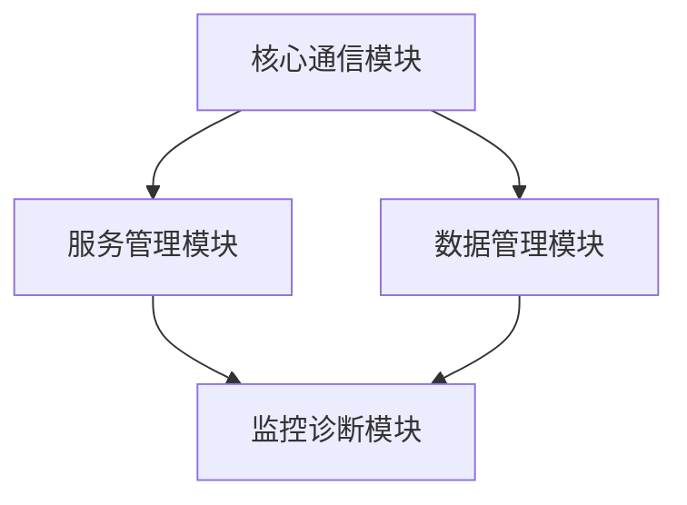

**2025/5/07 更新：项目架构重构与模块化设计**

# ModbusCommunicator

ModbusCommunicator 是一个基于 C# WPF 开发的 ModBus TCP 通信模拟器，采用 MVVM 架构模式设计。该工具可以模拟 ModBus TCP 服务器，用于工业自动化测试和开发环境中的通信调试。

## 🚧 项目状态

**当前版本：0.1.0-alpha**

### ✔️ 已完成功能
- MVVM基础架构搭建
- Prism模块化框架集成
- 基础服务接口定义
- 核心通信模块原型

### 🔧 近期开发重点
- ModBus TCP 服务器核心功能
- 客户端连接管理基础
- 基础日志系统实现
- 核心模块单元测试


### 🧩 模块化架构



## ✨ 主要功能

- ModBus TCP 服务器模拟
  - 支持标准 ModBus TCP 端口(502)配置
  - 支持自定义从站 ID (1-247)
- 寄存器操作
  - 读写保持寄存器
  - 批量寄存器操作
- 线圈操作
  - 读写线圈状态
  - 批量线圈操作
- 实时监控
  - 服务器运行状态显示
  - 客户端连接数监控
  - 实时数据变化监控
- 日志系统
  - 操作日志记录
  - 自动滚动显示
  - 日志导出功能

## 🛠 技术栈

- .NET 8.0
- WPF (Windows Presentation Foundation)
- MVVM 架构模式
- 模块化设计
- NModbus 库
- DryIoc (依赖注入容器)
- Microsoft.Xaml.Behaviors
- Prism框架 (模块化支持)


## 📦 项目结构

```
ModbusCommunicator/
├── Core/               # 核心通信模块
│   ├── Protocols/      # 协议实现
│   ├── Networking/     # 网络通信
│   └── Codecs/         # 数据编解码
│
├── Services/           # 服务管理模块
│   ├── Lifecycle/      # 服务生命周期
│   ├── ConnectionPool/ # 连接池管理
│   └── Schedulers/     # 任务调度
│
├── Data/               # 数据管理模块  
│   ├── Registers/      # 寄存器管理
│   ├── Persistence/    # 数据持久化
│   └── IO/             # 数据导入导出
│
├── Monitoring/         # 监控诊断模块
│   ├── Logging/        # 日志系统
│   ├── Diagnostics/    # 诊断工具
│   └── Metrics/        # 性能统计
│
├── Infrastructure/     # 基础设施
│   ├── Commands/       # 命令模式实现
│   ├── Events/         # 事件系统
│   └── Models/         # 基础数据模型
│
├── Presentation/       # 表现层
│   ├── ViewModels/     # 视图模型
│   └── Views/          # 视图组件
│
└── App/                # 应用核心
    ├── Config/         # 应用配置
    └── Bootstrap/      # 启动引导
```

## 🚀 开发环境要求

- Visual Studio 2022 或更高版本
- .NET 8.0 SDK
- Windows 操作系统

## 📝 待完成功能

1. 核心功能实现
   - [ ] ModBus TCP 服务器启动/停止功能
   - [ ] 客户端连接管理
   - [ ] 数据读写操作实现

2. 用户界面
   - [ ] 数据显示优化
   - [ ] 状态指示优化
   - [ ] 操作响应优化

3. 数据管理
   - [ ] 数据导出功能
   - [ ] 数据持久化
   - [ ] 配置保存功能

4. 系统稳定性
   - [ ] 异常处理机制
   - [ ] 日志系统完善
   - [ ] 性能优化


---

**注意：** 此项目仍在开发中，功能完全不稳定(因为压根未实现)。